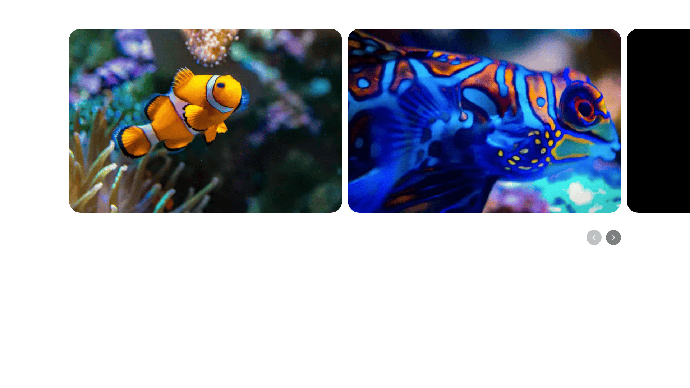

# Next.js + Splide を使ったアクセシブルなカルーセル

Next.js (App Router) と Splide を使って、キーボード操作とスクリーンリーダーに配慮したカルーセル UI を実装したサンプルです。



## 特徴

- Splide ベースのスライド UI（`perPage: 2` / モバイルは `perPage: 1`）
- スクリーンリーダー向け live region による現在位置アナウンス
- 前後ボタンの `disabled` 制御とフォーカス可能な操作 UI
- `aria-label` / `aria-controls` / `aria-roledescription` などのアクセシビリティ属性を付与
- Next.js の `Image` コンポーネントで画像最適化

## 技術スタック

- Next.js 16
- React 19
- TypeScript
- Splide
- Tailwind CSS 4

## セットアップ

```bash
pnpm install
```

## 開発サーバー起動

```bash
pnpm dev
```

ブラウザで [http://localhost:3000](http://localhost:3000) を開くと確認できます。

## 利用可能なスクリプト

- `pnpm dev`: 開発サーバー起動
- `pnpm build`: 本番ビルド作成
- `pnpm start`: 本番ビルド実行
- `pnpm lint`: ESLint 実行

## 主な構成

- `app/page.tsx`: サンプルのスライドデータを定義してカルーセルを表示
- `app/components/AccessibleCarousel.tsx`: Splide 初期化、ボタン制御、ライブリージョン更新など本体ロジック
- `public/`: デモ画像（`.avif`）と README 掲載用スクリーンショット

## カスタマイズ例

- `app/page.tsx` の `slides` 配列を差し替える
- `AccessibleCarousel` の `ariaLabel` を用途に合わせて変更する
- `AccessibleCarousel` 内の Splide オプション（`perPage` / `gap` / `speed` など）を調整する
